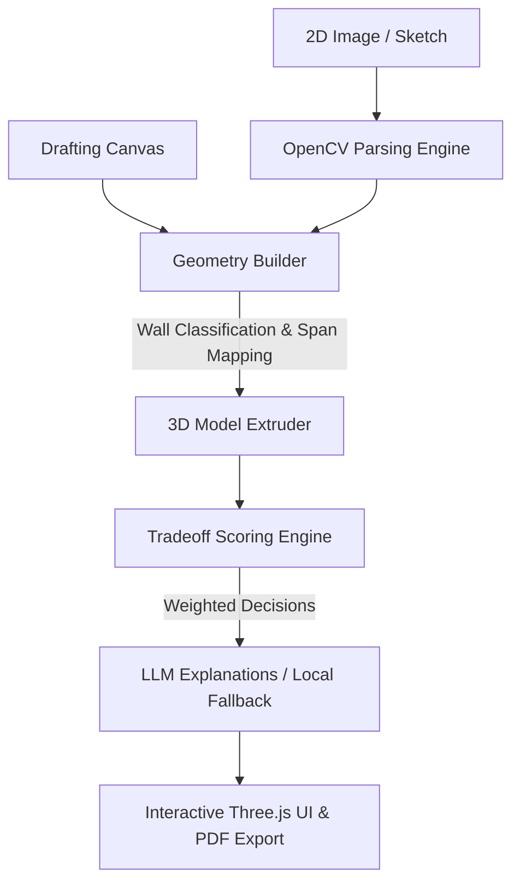

# Z-Axis: Autonomous Structural Intelligence

Z-Axis is a state-of-the-art full-stack platform designed to autonomously convert 2D floor plans (images, sketches, or custom drafting coordinates) into fully realized, interactive 3D structures. By marrying **OpenCV-based Computer Vision** with a custom **Multi-Criteria Tradeoff Decision Engine** and **DeepSeek/local LLM Insights**, Z-Axis provides architects, structural engineers, and homebuilders with automated 3D modeling and optimal construction material suggestions.

---

## 🚀 Key Capabilities

* **📷 6-Stage Autonomous AI Pipeline**: Seamlessly transitions from grayscale preparation, edge/wall detection, door and room clustering, scale mapping, 3D extrusion, and structural material recommendations.
* **🎨 Interactive Drafting Canvas**: Draw layouts from scratch inside the app using a grid-aligned vector drafting board, instantly feeding the coordinates into the 3D generation engine.
* **🧠 Multi-Criteria Tradeoff Engine**: Employs mathematical weighting algorithms considering cost, strength, and durability to match construction materials (RCC, Steel Frame, AAC Blocks, Red Brick) based on structural load types.
* **⚡ DeepSeek-Powered Engineering Rationale**: Automatically triggers LLM explanations (with seamless, zero-latency local fallback) detailing the engineering tradeoffs for each recommended element.
* **🔒 Secure JWT & OAuth 2.0 Auth**: Features cookie-based HTTP-Only JWT sessions and seamless Google Client Sign-in, backed by a persistent MongoDB architecture.
* **📊 PDF Report & JSON Exporting**: Generate comprehensive construction reports instantly or download structured structural node maps for external CAD integrations.

---

## 🛠️ System Architecture



### 💻 Technology Stack

* **Frontend**: HTML5, Vanilla JavaScript, TailwindCSS (dynamic custom config), Three.js (3D WebGL Web Studio), OrbitControls, GSAP & ScrollTrigger (animations), dat.GUI.
* **Backend**: Flask (Python), OpenCV, NumPy, Shapely (geometry computing), PyJWT, Bcrypt, Google Auth client libraries.
* **Database**: MongoDB (secure schema for local and Google OAuth accounts).
* **LLM Engine**: DeepSeek Chat API (`sk-` client interface) with fallback templated local explanation engines.

---

## 📂 Project Directory Structure

```text
Z-axis-main/
│
├── backend/
│   ├── auth/
│   │   ├── models.py         # MongoDB User collection hooks
│   │   ├── routes.py         # Auth endpoints (Register, Login, Google, Me)
│   │   └── utils.py          # Password hashing and JWT helpers
│   │
│   ├── explainer/
│   │   └── llm_explainer.py  # DeepSeek API integration + Context-aware fallback engine
│   │
│   ├── materials/
│   │   ├── material_db.json  # Base materials cost/strength/durability metrics
│   │   └── tradeoff_engine.py# Load-bearing, partition, and long-span weighting logic
│   │
│   ├── model3d/
│   │   └── model_generator.py# Generates Three.js-ready 3D coordinate schemas
│   │
│   ├── parser/
│   │   ├── floor_plan_parser.py # Advanced OpenCV architectural contour parsing
│   │   ├── geometry_builder.py  # Room/Wall mapping and load estimation
│   │   └── fallback_coords.py   # Reliable failover layout coordinates
│   │
│   ├── app.py                # Main Flask application with full pipeline routes
│   ├── requirements.txt      # Python library dependencies
│   └── .env                  # Environment secrets & database keys (git-ignored)
│
├── frontend/
│   ├── index.html            # Main dashboard and 2D/3D studio view
│   ├── draw.html             # Custom drafting table sketch canvas
│   ├── login.html            # Gateway Login & Register visual interface
│   ├── styles.css / draw-style.css # Professional glassmorphic layout styling
│   ├── viewer.js             # Three.js 3D WebGL renderer and 2D canvas controls
│   ├── draw-app.js           # Sketch editor tools and snap-to-grid math
│   ├── materials-ui.js       # Dynamic tables, cards, charts & LLM cards generator
│   ├── auth.js / auth-check.js # Session checkers & cookies interceptors
│   └── about-animation.js    # GSAP scroll animations
│
├── outputs/                  # Exported floorplan previews
└── README.md
```

---

## ⚙️ Setup & Installation

### 1. Prerequisites
Ensure you have the following installed:
* **Python 3.8+**
* **MongoDB** (running locally or via MongoDB Atlas)
* A modern web browser with WebGL enabled (Chrome, Safari, Firefox, Edge)

### 2. Backend Setup
1. Navigate to the `backend` folder:
   ```bash
   cd backend
   ```
2. Create and activate a python virtual environment (highly recommended):
   ```bash
   python -m venv venv
   # On Windows:
   venv\Scripts\activate
   # On macOS/Linux:
   source venv/bin/activate
   ```
3. Install the dependencies:
   ```bash
   pip install -r requirements.txt
   ```
4. Create a `.env` file in the `backend` root (using the template below) to configure MongoDB, API tokens, and JWT security keys.

#### `.env` Template
```ini
# MongoDB Connection Config
MONGO_URI=mongodb://localhost:27017/
MONGO_DB_NAME=zaxis_db

# Security & JWT Tokens
SECRET_KEY=your-highly-secure-jwt-secret-key
JWT_EXPIRATION_HOURS=24

# OAuth Integration
GOOGLE_CLIENT_ID=your-google-oauth-client-id.apps.googleusercontent.com

# LLM Structural Insights (DeepSeek)
DEEPSEEK_API_KEY=your-sk-deepseek-api-key
```

### 3. Run the Servers

#### Start the Flask Backend Server
Runs by default on port `5000`:
```bash
# In backend/ directory
python app.py
```

#### Start the Frontend Server
Since the frontend consists of static files, they must be served from an HTTP server to avoid CORS blockages. You can use standard Python or `npx` servers:
```bash
# In frontend/ directory
# Option A (Python):
python -m http.server 3000

# Option B (Node.js):
npx serve -l 3000
```

Open your browser and navigate to `http://localhost:3000` to start using the Z-Axis application.

---

## ⚖️ Tradeoff Decision Model

The Multi-Criteria Tradeoff Engine maps raw geometric structural objects onto specific construction materials using high-accuracy mathematical weighting profiles:

* **Long Spans (> 5.0m) / Columns**:
  Mandatorily filtered to high-performance, tensile-resistant frames. Only **Structural Steel** or **Reinforced Concrete (RCC)** are permitted:
  $$\text{Score} = (0.5 \times \text{Strength}) + (0.4 \times \text{Durability}) - (0.1 \times \text{Cost})$$
* **Load-Bearing Walls**:
  Heavily penalizes low-compressive blocks, choosing high structural density:
  $$\text{Score} = (0.5 \times \text{Strength}) + (0.3 \times \text{Durability}) - (0.2 \times \text{Cost})$$
* **Partition Walls**:
  Prioritizes budget, lightweight characteristics, and rapid installation block types:
  $$\text{Score} = (0.2 \times \text{Strength}) + (0.3 \times \text{Durability}) - (0.5 \times \text{Cost})$$

---

## 🔌 API Endpoints

### 🔐 Authentication (`/auth`)

* **`POST /auth/register`**: Registers a new local account. Validates email regex, password minimum length (8 chars), hashes credentials with Bcrypt, and responds with a secure HTTP-Only JWT cookie.
* **`POST /auth/login`**: Authenticates credentials, returning an HTTP-Only token cookie.
* **`POST /auth/google`**: Handles secure Client OAuth Token validation, provisioning users automatically if registering via Google.
* **`GET /auth/me`**: Restricts resource access, returning verified profile structures for signed-in sessions.
* **`POST /auth/logout`**: Instantly expires active cookies, clearing user sessions.

### 📐 Structural Processing (`/`)

* **`POST /parse`**: Processes an uploaded 2D floor plan image, mapping doors, rooms, and structural boundaries.
* **`POST /model`**: Extrudes and generates 3D geometries from custom JSON model configurations.
* **`POST /materials`**: Scores and ranks top-fitting construction materials for the processed structures.
* **`POST /explain`**: Synthesizes custom structural explanations using LLMs or the contextual math fallback.
* **`POST /pipeline`**: One-step full-pipeline API! Accepts an uploaded image, processes the computer vision pipeline, extrudes, recommends materials, runs LLM insights, and returns preview base64 rendering URLs in a single request.
* **`POST /pipeline-draw`**: Accepts vector drafted coordinates from the interactive drawing board and generates models, material matrices, and LLM advice.

---

## 📝 License
Built for the AI/ML Hackathon. Distributed under the MIT License. Reference individual files for specific dependencies.
